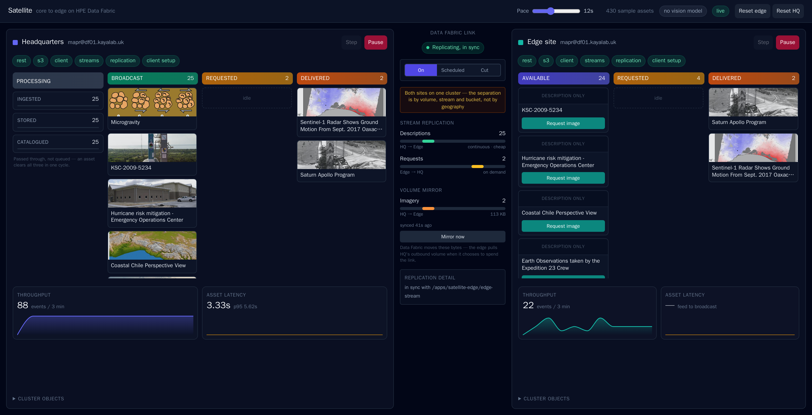
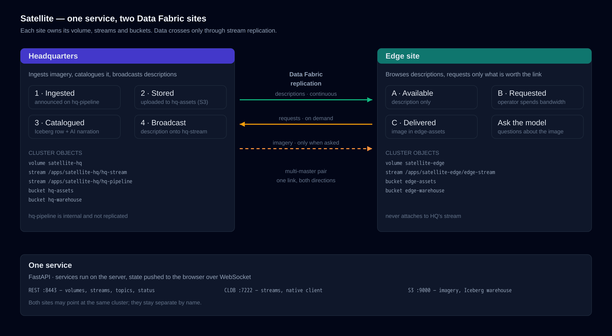

# Satellite — headquarters and a disconnected edge, sharing what matters

A field team on a satellite link cannot pull down everything headquarters has. They
need to know what *exists*, and then choose the few things worth spending bandwidth on.
**Satellite** is a working model of that pattern: an HQ site ingests imagery, catalogues
it, and broadcasts lightweight *descriptions* to every edge site; the edge browses those
descriptions and requests the handful it actually wants; only then does the imagery
itself get copied. A vision model can then describe what arrived, so an operator gets an
answer without opening every file.

It is built on [HPE Data Fabric](https://www.hpe.com/us/en/products/software/data-fabric-software.html)
stream replication, object storage and Iceberg, and it is a useful reference for anyone
designing for intermittent connectivity — disaster response, maritime, remote industrial
sites — where the real design problem is deciding what crosses the link.



## How it works



Each site owns its objects and attaches only to its own stream:

| | HQ | Edge |
|---|---|---|
| Volume | `satellite-hq` at `/apps/satellite-hq` | `satellite-edge` at `/apps/satellite-edge` |
| Stream | `/apps/satellite-hq/hq-stream` | `/apps/satellite-edge/edge-stream` |
| Internal stream | `/apps/satellite-hq/hq-pipeline` | — |
| Imagery volume | `satellite-hq-assets` | `satellite-edge-assets` (**mirror**) |
| Outbound volume | `satellite-hq-outbound` | — |
| Iceberg warehouse | `hq-warehouse` | `edge-warehouse` |

**Neither side ever reads or writes the other's stream.** The two streams are paired
multi-master, so HQ publishes the catalogue onto its own stream and the edge reads it
from its own; edge requests travel back the same way. Data crosses between the sites
only through Data Fabric replication — which is the mechanism the demo exists to show.

At HQ an asset moves through four stages, each handing off over HQ's internal pipeline
stream: **Ingested** announces that an asset exists, **Stored** writes the actual bytes
to HQ's imagery volume, **Catalogued** appends metadata and the AI narration to an Iceberg
table, and **Broadcast** publishes the description. HQ's internal chatter stays on a
separate, unreplicated stream — it is HQ's business, and pushing it down the link would
undercut the point.

Bulk data moves separately and only on request. The description is cheap and travels
continuously; the image is expensive and travels only when a field team asks for it.

**Data Fabric moves everything.** Descriptions and requests travel by stream
replication. The imagery travels by **volume mirroring**: HQ stages a requested asset
into `satellite-hq-outbound`, and the edge's imagery volume is a mirror of it. The edge
pulls that mirror when it decides to spend the link — on demand, on a schedule, or not
at all while the link is down. The application never copies the bytes itself; it stages
them and asks Data Fabric to move them.

### Cutting the link

The link between the sites can be **On**, **Scheduled** or **Cut**, and it pauses and
resumes Data Fabric stream replication for real. Cut it and HQ keeps ingesting while the
edge stops hearing about it, the backlog builds on the cluster and in the lag chart, and
restoring the link drains it within seconds. Scheduled mode opens the link for a window
every interval, which is closer to how a constrained link is actually run.

Imagery follows the same rule: while the link is down the edge cannot mirror, so a
requested asset sits staged in HQ's outbound volume until the link returns. **Mirror
now** pulls it deliberately.

This is the part worth showing to anyone designing for intermittent connectivity:
nothing is simulated, the messages really do queue on the cluster and really do catch
up, and the imagery really is moved by Data Fabric rather than by the app.

## The interface

One page, both sites side by side, with the **Data Fabric link** between them — that
centre column is the point of the demo: descriptions flowing outward continuously,
requests coming back, and imagery crossing only when a field team asks for it, with the
replication state read from the cluster rather than inferred.

Each site shows its pipeline as a **stage board**: an asset is one tile that moves left
to right between stages, columns are capped, and throughput and end-to-end latency are
charted underneath.

The demo runs on the **server**, not in the browser. Close the tab and the pipeline
keeps going; reopen it and the interface resynchronises. State is pushed over a
WebSocket, so nothing polls.

## What you need

A reachable Data Fabric cluster (7.x or 8.x) with:

| Service | Port | Used for |
|---|---|---|
| `apiserver` | 8443 | Creating volumes, streams and topics; status |
| `cldb` | 7222 | Streams, via the native client |
| ZooKeeper | 5181 | Client configuration |
| `nfs` | 2049 | Imagery, on Data Fabric volumes |
| `s3server` | 9000 | The Iceberg warehouse |

All five must be running and reachable from wherever you run the container. A default
Data Fabric install provides them.

S3 is used only for the Iceberg warehouse; credentials are minted per-user with
`s3keys gentempkey` and refreshed as they expire, so there are no long-lived
object-store secrets to store or rotate.

### What the container needs

Imagery lives on Data Fabric volumes, so the container mounts the cluster's NFS export
and needs privileges to do it. It never calls `maprcli` — provisioning is REST.

| Requirement | Why |
|---|---|
| `--cap-add SYS_ADMIN` | Mounting NFS is a privileged operation |
| Cluster NFS reachable on **2049** | Imagery is read and written over `/mapr` |
| Cluster CLDB on **7222**, apiserver **8443**, S3 **9000** | Streams, provisioning, warehouse |
| SSH to the HQ host (22) | The truststore is fetched from `/opt/mapr/conf` |
| `linux/amd64` | The Data Fabric client is x86-only |

**You do not need to stage anything.** A secure cluster requires its truststore on the
client, and the demo fetches it for you: once a cluster is configured — from `.env` or in
the interface — it copies `ssl_truststore` from `/opt/mapr/conf` on the HQ host over SCP,
which is the documented way a client obtains it. SSH credentials default to the cluster
credentials; override with `HQ_SSH_USER` / `HQ_SSH_PASSWORD` if they differ.

If SSH is unavailable, supply the file yourself and the fetch is skipped:

```bash
-v /path/to/ssl_truststore:/opt/mapr/conf/ssl_truststore:ro
```

It cannot be generated from the cluster's server certificate — the CLDB handshake rejects
one built that way.

> The MapR FUSE client would avoid NFS, and does not work in a container: it creates the
> mount, the process exits immediately, and every access then fails with "Transport
> endpoint is not connected" — including under `--privileged`, with an empty log. NFS
> mounts first try and is what the original demo used.

**HQ and the edge may point at the same cluster.** They stay separate by volume, stream
and bucket, so the demo behaves identically whether you have one cluster or two.


## Run it

```bash
cp .env.example .env
```

Then start it:

```bash
docker compose up --build -d
```

**You can leave `.env` empty.** The demo starts with nothing configured and you point it
at a cluster from the interface, which is the quickest way to try it. Setting `HQ_HOST`
and `EDGE_HOST` in `.env` just skips that step on every restart. Nothing talks to a
cluster until one is configured, and an unreachable one never stops the interface coming
up — that is where you go to fix it.

Then open <http://localhost:8080> — or the Docker host's address if your Docker context
points at a remote machine, since the port is published there and not on your localhost.
Set `PORT` in `.env` if 8080 is taken.

Each site's cluster can also be set from the interface — click the host next to a site's
name — so you can repoint the demo at a customer's cluster without restarting anything.

Connect each site to a cluster — click **Connect**, or the host next to a site's name to
change it later. Both sites may point at the same host.

Then each site offers **Prepare**. Do the **edge first** (its volume and warehouse),
then **HQ** (its volumes, the streams and topics, the replication pair, and the edge's
mirror volume). Every step is reported as it completes and it is safe to re-run.

Then press **Run** on each site. Assets begin flowing. On the edge, click **Request
image** on any available tile; it arrives under Delivered, where you can open it and ask
the vision model about it. **Step** advances a single cycle if you would rather drive it
by hand, and the **Pace** slider changes the rate mid-sentence.

**Reset edge** / **Reset HQ** remove everything that site owns and leave the rest of the
cluster untouched.

### Pointing at a vision model

Use **Model** in the footer; any OpenAI-compatible endpoint works, and the dialog has a
**Test** button that says whether the endpoint and model actually respond. Narration is
optional — the pipeline runs without it.

### Splitting HQ and edge across two clusters

Point each site at its own cluster — a hostname where CLDB and the apiserver are
reachable:

```bash
HQ_HOST=df01.example.com
EDGE_HOST=df02.example.com
```

Because neither side ever touches the other's stream, nothing about the design changes —
the replication pair simply spans two clusters instead of living on one. That needs a
trust relationship between them.

## Configuration

See [.env.example](.env.example) for the full list. The ones worth knowing:

| Variable | Default | Purpose |
|---|---|---|
| `HQ_HOST` / `EDGE_HOST` | — | Each site's cluster; may be the same host |
| `HQ_USER` / `HQ_PASSWORD` | `mapr` | HQ credentials |
| `EDGE_USER` / `EDGE_PASSWORD` | `mapr` | Edge credentials |
| `PORT` | `8080` | Port the interface is served on |
| `FEED_INTERVAL` | `12` | Seconds between feed injections |
| `FEED_BATCH` | `2` | Assets published per interval |
| `COLUMN_LIMIT` | `8` | Tiles kept per stage column |

`FEED_INTERVAL` and `FEED_BATCH` set the pace. The defaults are slow enough to narrate
over; raise them for an unattended screen. Volume, stream and bucket names are
overridable too, in case the defaults collide on a shared cluster.

## Built with

A FastAPI server on Python 3.12 with a React, Vite and Tailwind front end, talking over
a WebSocket. `mapr-streams-python` for the replicated streams, `boto3` for the Iceberg
warehouse on S3, PyIceberg for the catalogue, and the OpenAI client for the vision model.

The image is Rocky Linux 9 with the Data Fabric client installed from the package
repository. `maprtech/pacc` would be the obvious base and does not work: its newest tag
carries client 8.0, which cannot complete the secure CLDB handshake against an 8.1
cluster, and installing 8.1 over the top leaves a broken native library state.

## Status

Working demo, verified end to end against Data Fabric 8.1: ingest → store → catalogue →
broadcast → replicate → request → deliver.

Known limitations:

- The container is `linux/amd64` only, because the Data Fabric client is.
- Building the image needs credentials for HPE's package repository, or a reachable
  mirror via the `MAPR_REPO` / `MAPR_MEP_REPO` build arguments. Match the client version
  to your cluster: a client older than the cluster cannot authenticate to it.
- One container configures one Data Fabric client, so a two-cluster split relies on the
  trust relationship between them.
- The truststore is fetched over SSH from the HQ host. Where SSH is closed, bind-mount
  it instead; it cannot be derived from the server certificate.
- With one cluster the two-site split is real in every respect except geography.

## If something is not working

The interface is designed to tell you: each site shows a pill per subsystem, and hovering
one gives the reason. Common cases:

| Symptom | Cause | Fix |
|---|---|---|
| `cluster` red, "no cluster configured" | Nothing connected yet | **Connect** on either site |
| `rest` red, "Name or service not known" | Hostname wrong or DNS cannot resolve it | Check `HQ_HOST`; the container must resolve it |
| `client setup` red, "truststore: could not copy…" | SSH to the HQ host failed | Check `HQ_SSH_USER` / `HQ_SSH_PASSWORD`, or bind-mount the file |
| `client setup` red, "ticket: ..." | Credentials wrong, or client version older than the cluster | Check the user, and match `MAPR_REPO` to your cluster version |
| `client setup` red, "nfs mount: ..." | Missing `CAP_SYS_ADMIN`, or NFS unreachable | Add the capability; check port 2049 |
| `streams` red after Prepare | Ticket missing — streams authenticate with it | Fix `client setup` first |
| Imagery never arrives at the edge | Mirror has not run | **Mirror now**, or set the link to On |
| Everything red, container restarting | Should not happen | The container is built not to exit on cluster problems; please open an issue |

The container starts and stays up whether or not a cluster is reachable, so you can
always open the interface to see what it thinks is wrong. Logs:

```bash
docker compose logs -f satellite
```

## Repeating this demo

It is designed to be run repeatedly against the same cluster:

- **Prepare** is idempotent — re-running it reports each object as existing and changes
  nothing.
- **Reset** removes only what that site owns and leaves the rest of the cluster alone.
  Reset the edge and prepare HQ again and the edge is rebuilt, mirror included.
- Object names are configurable, so several people can run it against one shared cluster
  by setting `APP_NAME` differently.

## See it run

[A 97-second walkthrough](docs/satellite-demo.mp4): an asset requested at the edge, the
volume mirror pulled deliberately, then the link cut and restored while the backlog
builds on the cluster and drains again.

## Further reading

[Deciding what crosses the link](docs/edge-to-core-with-data-fabric.md) — the design
thinking behind the demo, the Data Fabric capabilities it leans on, and what building it
taught us about architecting for constrained connectivity.

## Contributing

Issues and pull requests welcome.

## Licence

MIT — see [LICENSE](./LICENSE).
